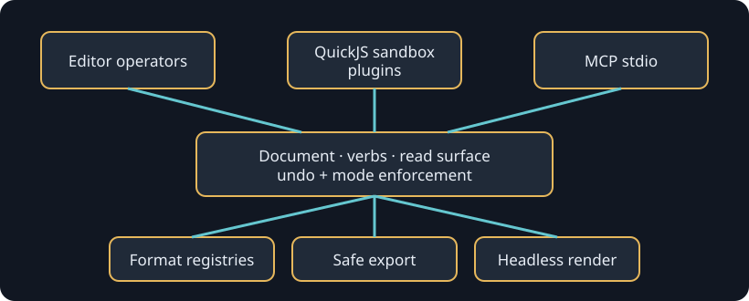

# Plugins and automation

Plugins, the editor, and MCP share `Document`, named verbs, importer/exporter
registries, and the read surface. They are consumers of one mutation boundary,
not parallel implementations.

